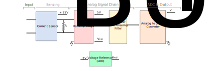

# Current Measurement Card

This document describes the design considerations and implementation details for the current measurement card. 
A block diagram is presented and each component is discussed in detail. Specifications of each component are provided based on the datasheet.

## Relevant Hardware Versions

REV C

## Design Requirements and Considerations

The current measurement card was designed to the following specifications:

1. Current measurement range of +/- 55A
2. Noise immunity
3. Quick adjustment of the sensing range
4. High sensor bandwidth
5. SPI output to interface with the sensor motherboard

## Block Diagram
The high level block diagram of the current sensor card is shown below:

### Current Sensor
LEM LA 55-P current sensor is selected for this design, as it is the only sensor available from LEM with an open aperture and PC pins that can measure +/-55A. 
The open aperture was a requirement as it allows for the range to be easily scaled down just by adding turns to the primary. 
The LA 55-P is a closed loop compensated hall effect transducer that has an accuracy of +/-0.65% and linearity of <0.15% which is quite good compared to other sensors from LEM. 
It has an excellent bandwidth of 200khz and a low impedance current output that is inherently more immune to noise than a high impedance voltage output. 

### Burden Resistor (_R__BURDEN_)
A burden resistor (`R5`) is used to convert the current output of the sensor to a voltage. The burden resistance, _R__BURDEN_ was calculated using the following equation

_V__BURDEN_  = _I__PRIMARY_(_N_2/_N_1)_R__BURDEN_

_R__BURDEN_  = (10 V/70 A)*(1000/1) = 143Ω 

The LA 55-P datasheet specifies the burden resistor value must be between 135Ω and 155Ω so a 150Ω resistor was selected.

### Op Amp Stage
The voltage across the burden resistor is a bipolar signal (voltage span includes both positive and negative voltages).
A non-inverting level translation circuit is designed using Op Amps as shown here:

This circuit is used to translate the voltage across the burden resistor, which is bipolar, to the ADC input range of 0-5V. The resistor values can be calculated analytically. However, the algebra gets quite complicated. Hence it was computed using TI analog engineer's calculator. 

**Note:** As the op-amp output voltage approaches the supply rails, it tends to distort and behave nonlinearly so the output voltage is limited to actually be 0.2V to 4.8V

### Voltage Reference (LDO)
The voltage reference, _V__REF_ is needed for the ADC. As 5V is readily available, and the LDO will have a minimum drop out voltage,  _V__REF_ = 4.5V was chosen. The LDO selected was `REF5045` from Texas Instruments, which can take a 5V input and provide a 4.5V reference output. This has an accuracy of 0.1% and low noise of 3μVpp/V.

### First Order Anti-Aliasing Filter
A first order RC filter is implemented on the output of the op amp circuit.The cutoff frequency was set at 48kHz and the following equations was used for the computation:

_f_c = 1 / (2 π _RC_)

**Note:** The cutoff frequency can easily be changed by swapping out `R3`.

### Analog to Digtal Converter
A single-ended ADC was selected. The ADC used is the Texas Instruments ADS8860. It is pseudo-differential input, SPI output, SAR ADC. 
The maximum data throughput for a single chip is 1 MSPS but decreases by a factor of N for N devices in the daisy-chain. 
The input voltage range is 0-5V.

### Connectors
- There are two screw terminals `P5` and `P6` to connect the conductor in which the current is to be measured
- A screw terminal block `P1` is used to connect the +-15V supply for the current sensor
- A BNC terminal is available to directly measure the output across the burden resistor _R__BURDEN_

## Datasheets
- [Current Sensor](../REV20200830C/datasheets/LA55P_Current%20Sensor.pdf)
- [Op Amp](../REV20200830C/datasheets/OPA320_OpAmp.pdf)
- [Voltage Reference (LDO)](../REV20200830C/datasheets/REF5045_LDO.pdf)
- [Analog to Digital Converter](../REV20200830C/datasheets/ADS_8860_ADC.pdf)

