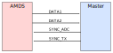

# Firmware Architecture

**Description of the architecture design of the AMDS mainboard firmware.**

## Contents

- [Introduction](#introduction)
- [Architecture](#architecture)
- [Future Improvements](#future-improvements)

## Introduction

This document outlines the firmware architecture which runs the AMDS mainboard. By understanding how the mainboard works, users will be able to understand the performance limitations of the system. While the current firmware design will work for most applications, some users will find that the design must be tweaked to meet their system performance goals. Potential ideas for improvements are provided in the following sections which could be implemented in the future.

The main goal of the AMDS mainboard is to interface voltage/current sensor cards to an external control board (typically the [AMDC](https://amdc.dev/)). Therefore, the AMDS platform should be thought of as a slave to the main controller (master). In steady-state operation, the master is responsible for triggering the AMDS to do two things: (1) sample the analog signals on the sensor cards (2) send the latest data to the master. Since the AMDS is typically used in motor drives, these operations happen in real-time at 1000s of times per second. To facilitate the desired real-time operation, the AMDS has an embedded processor which orchestrates its behavior. The firmware running on this processor directly determines the performance of the sensor interface in terms of sampling latency and throughput.

## Architecture

While the architecture of the AMDS firmware is fairly simple, the I/O interface, priority of code, and latencies are critical to the overall performance.

### Interface to Master

The AMDS firmware is designed to interface to the master controller over four logical wires: 2x TX and 2x RX. Physically, these signals are all diff pairs for noise immunity.

#### RX Signal: `SYNC_ADC`

One of the two signals, `SYNC_ADC`, is used to trigger ADC sampling. Nominally, the signal is a square wave. One each edge, the AMDS samples all the sensor cards on the mainboard. Normally, the master triggers a transition on this RX signal when the PWM carrier is at a peak or valley. This synchronizes the ADC sampling to the inverter PWM, thus reducing sampling noise.

#### RX Signal: `SYNC_TX`

The other RX signal, `SYNC_TX`, is used to trigger the AMDS to transmit the latest ADC samples back to the master. It is also normally a square wave. On each edge transition, all eight ADC samples are streamed to the master.

#### TX Signals: `DATA1` and `DATA2`

The two TX signals are controlled by the AMDS and go to the master. These are only used to send ADC sample data to the master. When the `SYNC_TX` RX signal is triggered, the AMDS starts sending the latest data to the master using the two TX wires. Two lanes are used so that the data can be transmitted at twice the speed, thus reducing latency.

The format of the data sent on the TX signals is UART. This means there is no clock line between the master and AMDS: the interface is completely asynchronous. The UART is configured to run at 25 Mbps. Conceptually, the TX lines are actually two distinct UART devices, each with only one-way communication.

### Interrupt-Driven Design

TODO...

### Performance Limitations

TODO...

## Future Improvements

Foo bar.
