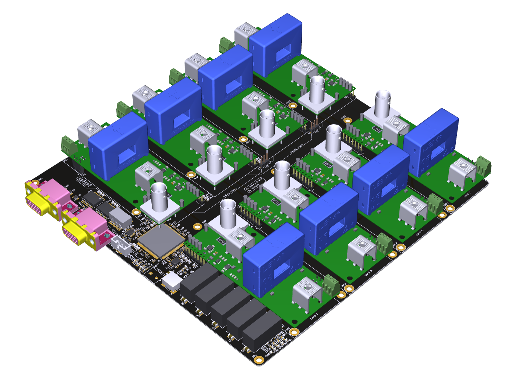

# Mainboard

The mainboard provides a single interface to multiple analog input PCBs (up to 8 daughtercards can be installed). The board features a microcontroller that operates ADCs on each daughter card and presents an isolated, high speed digital interface that can be connected to a digital system control board (this board is designed to connect directly to an expansion port of the [AMDC](https://github.com/severson-group/amdc-hardware)). Design features are implemented to minimize EMI and facilitate operation in an electric motor drive.

The details of the implementation can found in the [`docs/` folder](https://github.com/Severson-Group/AMDS/blob/develop/Mainboard/docs/README.md).
