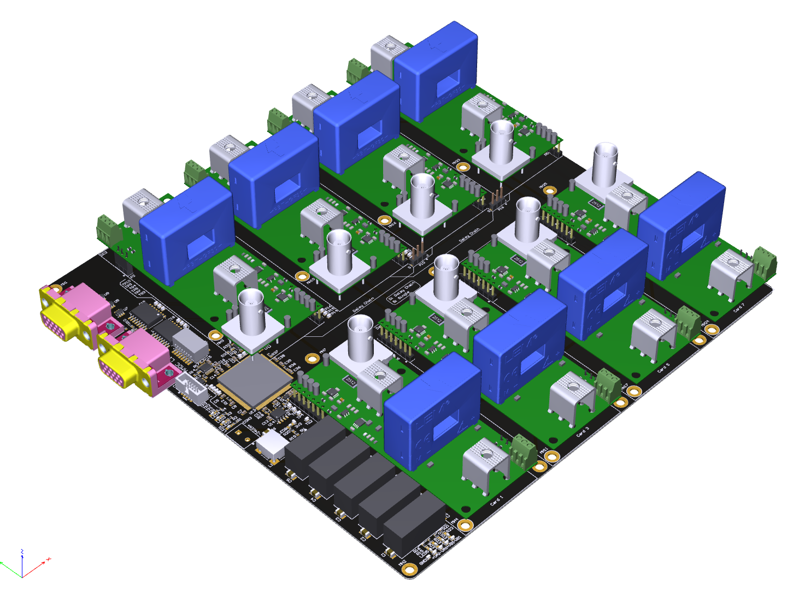

# Sensor Motherboard

Sensor mother board is used for interfacing sensor daughter cards with the AMDC. This board can accomodate 8 daughter cards. This board uses robust isoSPI and differential IO to communicate with the AMDC.

The details of the implementation can found in the following document

## [Motherboard](https://github.com/Severson-Group/SensorCard/blob/Motherboard_REVC/Motherboard/docs/Motherboard_REVC.md)
