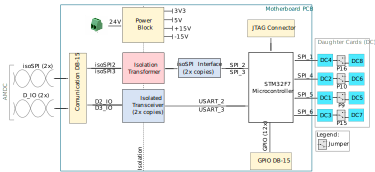

# Motherboard REVC

## Relevant Versions of AMDC Hardware

## Design Requirements and changes from previous versions

## Block Diagram / External Connections

### 1. Comunication DB15 Connector

The pin mappings is shown:

| Pin number | Signal name |
|------------|--------|
| 1 | 5V_IN |
| 2 | D2_I_P |
| 3 | D2_I_N |
| 4 | D3_I_P |
| 5 | D3_I_N |
| 6 | NC |
| 7 | isoSPI2_P |
| 8 | isoSPI2_N |
| 9 | isoSPI3_P |
| 10 | isoSPI3_N |
| 11 | GND |
| 12 | D2_O_P |
| 13 | D2_O_N |
| 14 | D3_O_P |
| 15 | D3_O_N |

### 2. GPIO DB15 Connector

The pin mappings is shown:

| Pin number | Signal name |
|------------|--------|
| 1 | 3V3 |
| 2 | GPIO_1 |
| 3 | GPIO_2 |
| 4 | GPIO_3 |
| 5 | GPIO_4 |
| 6 | GPIO_5 |
| 7 | GPIO_6 |
| 8 | GPIO_7 |
| 9 | GPIO_8 |
| 10 | GPIO_9 |
| 11 | GPIO_10 |
| 12 | GPIO_11 |
| 13 | GPIO_12 |
| 14 | GND |
| 15 | GND |

### 2. isoSPI communication interface

The isoSPI communication interface is implemented using [LTC6820](https://www.analog.com/media/en/technical-documentation/data-sheets/LTC6820.pdf). This IC provides a bi-directional interface between standard SPI signals and differential pulses. For termination, 120 ohms resistor is added. The maximum and minimum operating conditions are provided in the following table:

| Parameter                             |    Conditions     |   MIN   |  MAX  |
|---------------------------------------|-------------------|---------|-------|
| Supply voltage VDD (Differential side)|                   | 2.7 V   | 5.5 V |
| IO supply voltage VDDS (SPI side)     |                   | 1.7 V   | 5.5 V |
| High-level input voltage              |VDDS = 2.7V to 5V  | 0.7 VDDS| VDDS  |
| High-level input voltage              |VDDS = 1.7V to 2.7V| 0.8 VDDS| VDDS  |
| Low-level input voltage               |VDDS = 2.7V to 5V  | 0       | 0.3 VDDS  |
| Low-level input voltage               |VDDS = 1.7V to 2.7V| 0       | 0.2 VDDS  |

This IC can operate at a maximum SPI communication speed of 1 Mbps. The bias resistors (RB1 and RB2) are used to adjust the drive currents to the differential lines. The bias resistors (RB1 and RB2) used in the design will set the drive currents to 10 mA. The maximum supply current consumed by the IC including to drive currents for differential lines is 15.8 mA which corresponds to 79 mW for 5 V supply. More information regarding the operating conditions, bias resistors, maximum throughput rate, can be found in the [datasheet](https://www.analog.com/media/en/technical-documentation/data-sheets/LTC6820.pdf). 

### 3. isoSPI isolation transformer

To add isolation to the differential isoSPI signals, an external isolation barrier is required. This is implemented by adding pulse transformer HX1188NLT, which has 1:1 turns ratio. More information on the pulse transformer is found in the [datasheet](https://media.digikey.com/pdf/Data%20Sheets/Pulse%20PDFs/10_100BASE-T%20Single%20Port%20SMD%20Magnetics_Rev2008.pdf).

### 4. Isolated Transceiver

## PCB Layout
