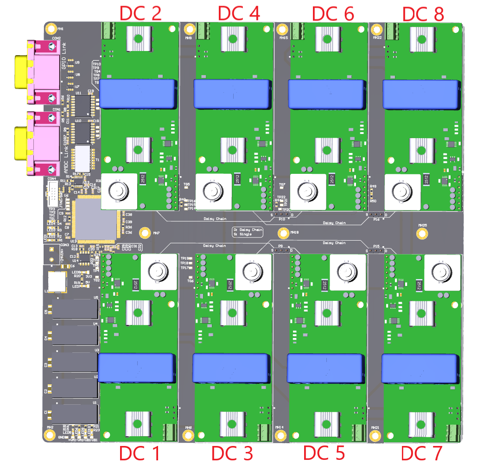
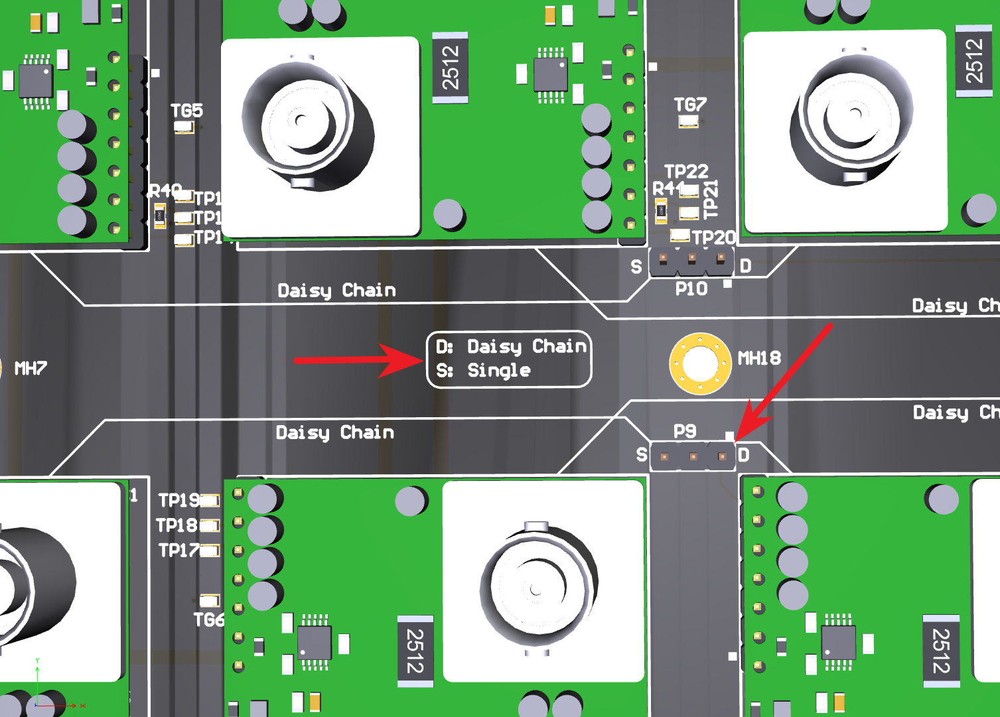
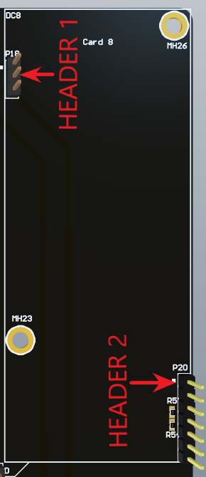

# Sensor Motherboard

This document describes the design consideration and implementation details for the sensor motherboard. This board is used as an interface between sensor daughter cards and other external controller. This board can connect up to eight daughter cards, it has slots where daughter cards can be plugged in. This board has STM32F7 MCU which communicates with external controller and the daughter cards. Standard SPI is used to interface with the daughter cards. High speed differential IO is used to transmit sensor data to the external controller. The IsoSPI communication interface can be used by the controller to send commands to the motherboard MCU (at low frequency).

## Relevant Hardware Versions

REVC

## Application / Purpose

The motherboard is specifically designed to interface directly to the isoSPI connector of [AMDC REVD](https://github.com/Severson-Group/AMDC-Hardware).

## Features

- Can connect up to 8 daughter cards
- Robust communication interface using differential IO
- Powerful STM32F7 MCU
- High throughput of up to 1 MSPS (depending on ADC device on daughter cards)

## Block Diagram and SPI Connection Configuration

The eight daughter cards (DC) transmit data to the STM32 MCU using standard SPI protocol. The daughter cards are grouped into four pairs of daisy chain connections. See the following block diagram.

The daughter cards can be connected in daisy chain pair configuration (D) or single SPI configuration (S). The daisy chain configuration will have throughput of 500 kSPS. If the number of daughter cards is less than or equal to four, then single SPI configuration can be used to get higher throughput. This single SPI configuration will have throughput of 1 MSPS. The configuration can be changed using jumpers (P9, P10, P15, P16) as shown in the following figure.

## External Connections

There are two interfacing DB-15 connectors on the measurement board. One connector is used for isoSPI and differential IO communication, and another connector is used for general purpose IO, which are connected to the GPIO pins of the MCU.

### DB15 Connector 1: IsoSPI and Differential IO 

| Pin number | Signal name |
|------------|--------|
| 1 | 5V_IN |
| 2 | D2_I_P |
| 3 | D2_I_N |
| 4 | D3_I_P |
| 5 | D3_I_N |
| 6 | NC |
| 7 | isoSPI2_P |
| 8 | isoSPI2_N |
| 9 | isoSPI3_P |
| 10 | isoSPI3_N |
| 11 | GND |
| 12 | D2_O_P |
| 13 | D2_O_N |
| 14 | D3_O_P |
| 15 | D3_O_N |

### DB15 Connector 2: GPIO

| Pin number | Signal name |
|------------|--------|
| 1 | 3V3 |
| 2 | GPIO_1 |
| 3 | GPIO_2 |
| 4 | GPIO_3 |
| 5 | GPIO_4 |
| 6 | GPIO_5 |
| 7 | GPIO_6 |
| 8 | GPIO_7 |
| 9 | GPIO_8 |
| 10 | GPIO_9 |
| 11 | GPIO_10 |
| 12 | GPIO_11 |
| 13 | GPIO_12 |
| 14 | GND |
| 15 | GND |

## Systems on Board

Per the block diagram above, the motherboard is made of several systems, as explained below.

### IsoSPI Communication Interface

The isoSPI communication interface is implemented using [LTC6820](https://www.analog.com/media/en/technical-documentation/data-sheets/LTC6820.pdf). This IC provides a bi-directional interface between standard SPI signals and differential pulses. The operating conditions are provided in the following table.

| Parameter                             |    Conditions     |   MIN   |  MAX  |
|---------------------------------------|-------------------|---------|-------|
| Supply voltage VDD (Differential side)|                   | 2.7 V   | 5.5 V |
| IO supply voltage VDDS (SPI side)     |                   | 1.7 V   | 5.5 V |
| High-level input voltage              |VDDS = 2.7V to 5V  | 0.7 VDDS| VDDS  |
| High-level input voltage              |VDDS = 1.7V to 2.7V| 0.8 VDDS| VDDS  |
| Low-level input voltage               |VDDS = 2.7V to 5V  | 0       | 0.3 VDDS  |
| Low-level input voltage               |VDDS = 1.7V to 2.7V| 0       | 0.2 VDDS  |

This IC can operate at a maximum SPI communication speed of 1 Mbps. The bias resistors (RB1 and RB2) are used to adjust the drive currents to the differential lines. The bias resistors (RB1 and RB2) used in the design will set the drive currents to 10 mA. The maximum supply current consumed by the IC including to drive currents for differential lines is 17 mA which corresponds to 85 mW for 5 V supply.

### IsoSPI Isolation Transformer

To add isolation to the differential isoSPI signals, an external isolation barrier is required. This is implemented by adding pulse transformer HX1188NLT, which has 1:1 turns ratio. More information on the pulse transformer is found in the [datasheet](https://media.digikey.com/pdf/Data%20Sheets/Pulse%20PDFs/10_100BASE-T%20Single%20Port%20SMD%20Magnetics_Rev2008.pdf).

### Isolated Transceiver

The [ISO3086T](https://www.ti.com/lit/ds/symlink/iso3086t.pdf?HQS=TI-null-null-digikeymode-df-pf-null-wwe&ts=1596613093516) is used for the isolated transiever for differential IO. This IC provides a bi-directional interface between standard USART signals and differential IO. This IC has signaling rate of up to 20 Mbps. The operating voltage is provided in the following table,

| Parameter                             |    Conditions     |   MIN   |  MAX  |
|---------------------------------------|-------------------|---------|-------|
| Supply voltage VCC2 (Bus-side)        |                   | 4.5 V   | 5.5 V |
| IO supply voltage VCC1 (UART side)    |   3.3V operation  | 3 V     | 3.6 V |
| IO supply voltage VCC1 (UART side)    |    5V operation   | 4.5 V   |  5 V  |

The maximum supply current consumed by the IC including to drive currents for differential lines is 60 mA, which corresponds to 300 mW for 5 V supply. 
 
### STM32F7 Microcontroller

STM32F7 has core ARM 32-bit Cortex M7 CPU. This IC can operate at supply voltage of 1.7 V to 3.6 V. JTAG / SWD interface is used for debugging and programing the MCU. It has 6 SPIs which is used for daughter card and AMDC isoSPI interfaces. The maximum speed of the MCU SPI interace is 54 Mbps. It has 4 USART with maximum baud rate of 26 Mbps, which are used to transmit daughter card data to the AMDC. GPIO pins of the MCU can be accessed using GPIO connector. More information on this MCU can be found [here](https://www.st.com/content/ccc/resource/technical/document/datasheet/group3/c5/37/9c/1d/a6/09/4e/1a/DM00273119/files/DM00273119.pdf/jcr:content/translations/en.DM00273119.pdf).

## Daugter Card Interface

In order to design a daugter card, the interface information provided in this section will be useful. Each daugter card slot has two headers, where the daughter card can be plugged in. See the following figure.

One header is used to supply power to the cards and the other header is used for SPI interface. 

### Header 1: Power Supply

| Pin number | Signal name |
|------------|--------|
| 1 | +15V |
| 2 | GND |
| 3 | -15V |

### Header 2: SPI interface

| Pin number | Signal name |
|------------|--------|
| 1 | 5V |
| 2 | 3V3 |
| 3 | GND |
| 4 | DIN (ADC IN, MOSI) |
| 5 | DOUT (ADC OUT, MISO) |
| 6 | SCLK |
| 7 | CONVST (Conversion start) |

For information regarding the placement of the headers, refer the [motherboard PCB](https://github.com/Severson-Group/SensorCard/blob/Motherboard_REVC/Motherboard/altium/SensorMotherBoard.PcbDoc). For more information on designing daughter card (like ADC selection), refer the [analog card documentation](https://github.com/Severson-Group/SensorCard/tree/develop/AnalogCard/docs).
