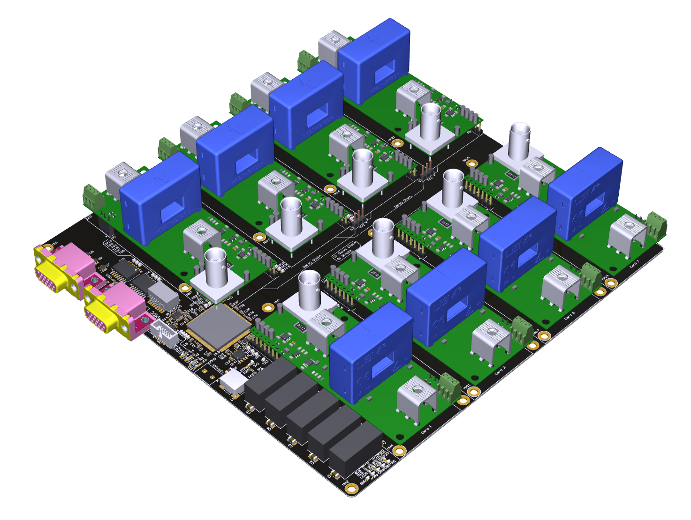

# Advanced Motor Drive Sensing System (AMDS)

The AMDS is a hardware platform for sensing parameters such as currents and voltages in power electronic systems. 
The platform includes:

-  Sensor cards to measure [low voltage](./LowVoltageCard), [high voltage](./HighVoltageCard), and [currents](./CurrentCard).
-  A [mainboard](./Mainboard) that serves as a carrier board for upto 8 sensor cards.
-  SPI interface between the sensor cards and the mainboard.
-  Robust differential IO communication to transmit sensor data to an external controller such as the [AMDC](https://amdc.dev/).

## Documentation
Detailed documentaion for each sensor card and the mainboard are available in the respective folders.

## Repository Structure
Each sensor card and the mainboard have a corresponding folder in the root level of the repository. These folders are organized as follows:

- The `altium` sub-folder contains all files pertaining to schematics / board design in Altium Designer. These files are the latest working copy of the project.

- The `REVyyyymmdd*` sub-folder represents snapshots of the project that were used to produce a physical PCB. These directories contain the Gerber, Drill (Excellon format), Bill of Materials (XLS), and Schematic (PDF) files.

  - `REV` indicates a revision of design for manufacturing
  - `yyyymmdd` indicates the date on which design was frozen
  - `*` (letter) indicates which revision in sequence (A - first, B - second, etc.)
  
- The `docs` sub-folder contains documentation for the PCB.
