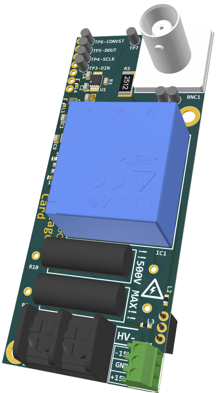
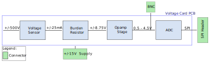

# Voltage Sensor Card

This document describes the design consideration and implementation details for the voltage sensor card, which serves as a daughter card for the sensor motherboard.
A block diagram is presented and each component is discussed in detail. Specifications of each component are provided based on the datasheet.

## Relevant Hardware Versions

REV C

## Design Requirements and Considerations

The voltage measurement card was designed to the following specifications:

1. Voltage measurement range of +/- 500V
2. SPI output to interface with the sensor motherboard
3. +/- 10V BNC output

## Block Diagram
The high level block diagram of the voltage sensor card is shown below:

### Voltage Sensor
The voltage sensor selected is the LEM LV 25-P, which basically senses the current proportional to the voltage to be measured. The sensor has a nominal input current of 10mA, an accuracy of 0.8%, and a linearity error under 0.2%. Two 25kΩ, 5W input resistors `R9` and `R10` are used to get a differential voltage measuring range up to +/- 500V. 
The sensor output is a current in the range of +/-25mA. 

To vary the voltage measurement range, the input resistors `R9` and `R10` can be suitably varied such that the input current to the sensor is limited to 10mA.
For example, to get a voltage measurement range of 250V, the resistor values of `R9` and `R10` should be reduced to 12.5kΩ each.

### Burden Resistor
The output of the voltage sensor is a current in the range of +/-25mA, which is converted to a voltage in the desired range using a burden resistor `R5`. The present implementation converts the sensor output current to a +/-8.75V signal using a burden resistor of 350Ω.

### Level shift stage
The voltage across the burden resistor is a bipolar signal (voltage span includes both positive and negative voltages). A non-inverting level translation circuit is designed using Op Amps as shown here:

This circuit is used to translate the voltage across the burden resistor, which is bipolar, to the ADC input range of 0-4.5V. The resistor values can be calculated analytically using the following formula:

The algebra can get quite complicated when solving it analytically. So the resistor values were computed using the TI analog engineer's calculator.

**Note:** As the op-amp output voltage approaches the supply rails, it tends to distort and behave nonlinearly so the output voltage is limited to actually be 0.2V to 4.5V.

### RC Filter
A first order RC filter is implemented on the output of the op amp circuit. The cutoff frequency was set at 48kHz and the following equations was used for the computation:

_f_c = 1 / (2 π _RC_)

**Note:** The cutoff frequency can easily be changed by swapping out `R3`.

### Analog to Digital Converter
To increase noise immunity, the card has an inbuilt Analog to Digital Conversion (ADC) IC. The ADC used is the Texas Instruments ADS8860. It is pseudo-differential input, SPI output, SAR ADC. The maximum data throughput for a single chip is 1 MSPS but decreases by a factor of N for N devices in the daisy-chain. 

**Note:** The different stages of the voltage sensor card described above convert the input voltage, to a voltage in the range of 0.2V - 4.5V. Therefore, 0V input voltage corresponds to 2.35V at the ADC input. The positive peak corresponds to 4.5V and the negative peak corresponds to 0.2V.

### Connectors
- The HV terminal block `B1` with screw connectors is used to connect the HV terminals across which voltage has to be measured. 
- A screw terminal block `P1` is used to connect the +-15V supply for the current sensor
- A BNC terminal is available to directly measure the output across the burden resistor.

### Footprints
A user may want to change some of the passive components based on the range required and the RC filter cutoff frequency desired. The footprints of passive components that may need to be replaced i.e, the burden resistor (`R5`), the resistors in the Op Amp stage, and the RC filter components is provided here for quick reference. Note that these footprints are imperial codes and **not metric codes**.

| Component | Footprint |
| ---- | ----- |
| R3   |  0603|
| R4   | 0603 |
| R5 | 2512 |
| R6 | 0603 |
| R8 | 0603 |
| C5 | 0603 |

The input resistors `R9` and `R10` are 5W thru-hole resistors.

### Datasheets

- [Voltage sensor](https://www.lem.com/sites/default/files/products_datasheets/lv_25-p.pdf)
- [Op Amp](https://www.ti.com/lit/ds/symlink/opa320.pdf?ts=1607198422116)
- [Voltage Reference (LDO)](https://www.ti.com/lit/ds/symlink/ref5045.pdf?ts=1607282986767&ref_url=https%253A%252F%252Fwww.ti.com%252Fproduct%252FREF5045)
- [ADC](https://www.ti.com/lit/ds/symlink/ads8860.pdf)
