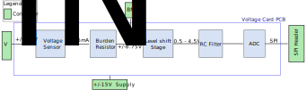

# Voltage Sensor Card

This document describes the design consideration and implementation details for the voltage sensor card, which serves as a daughter card for the sensor motherboard.

## Relevant Hardware Versions

REV B

## Design Requirements and Configurations

The voltage sensor selected is the LEM LV 25-P, which can measure the differential voltage of up to +/- 500V. This sensor has an accuracy of 0.8% and a linearity of <0.2%.
The sensor converts the input voltage to the current output (range of +/-25mA), which is converted to the +/-10V signal using a burden resistor.
The intermediate op-amp stage converts the +/-10V signal to 0-5V, which can be measured directly using the BNC connector. 
To increase noise immunity, the card has an inbuilt Analog to Digital Conversion (ADC) IC. The ADC selected is the TI ADS8860, which has a SPI output. 
The maximum data throughput of 1 MSPS can be obtained from this ADC. 

### Datasheets

- Voltage sensor, [LEM LV 25-P](https://www.lem.com/sites/default/files/products_datasheets/lv_25-p.pdf)
- ADC, [ADS8860](https://www.ti.com/lit/ds/symlink/ads8860.pdf?ts=1599444147857&ref_url=https%253A%252F%252Fwww.ti.com%252Fproduct%252FADS8860)
